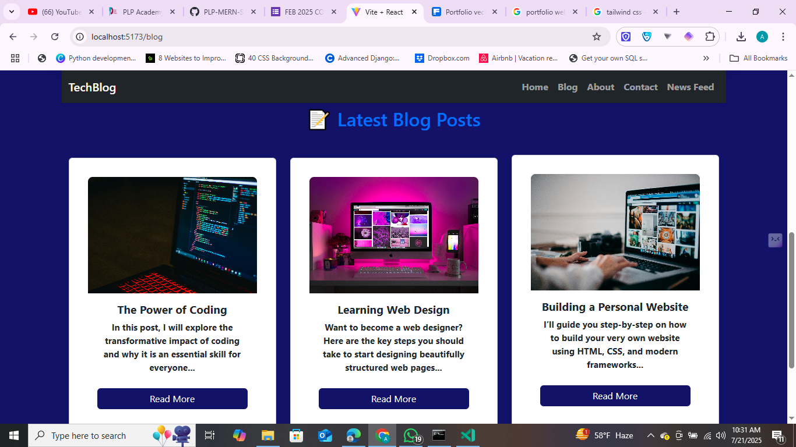
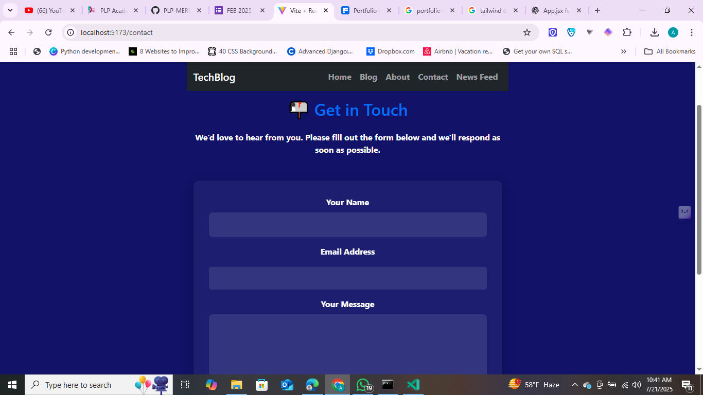

# React + Vite

This template provides a minimal setup to get React working in Vite with HMR and some ESLint rules.

Currently, two official plugins are available:

- [@vitejs/plugin-react](https://github.com/vitejs/vite-plugin-react/blob/main/packages/plugin-react) uses [Babel](https://babeljs.io/) for Fast Refresh
- [@vitejs/plugin-react-swc](https://github.com/vitejs/vite-plugin-react/blob/main/packages/plugin-react-swc) uses [SWC](https://swc.rs/) for Fast Refresh

## Expanding the ESLint configuration

If you are developing a production application, we recommend using TypeScript with type-aware lint rules enabled. Check out the [TS template](https://github.com/vitejs/vite/tree/main/packages/create-vite/template-react-ts) for information on how to integrate TypeScript and [`typescript-eslint`](https://typescript-eslint.io) in your project.


# 💻 Alana303 – Personal Blog & Portfolio (Frontend Capstone Project)

Welcome to **Alana303**, a modern and minimal personal blog and portfolio interface built using **React.js (Vite)**. This project showcases blog posts, an engaging homepage, an about section, and a working contact form powered by **EmailJS**.

This frontend project is part of my Capstone submission and demonstrates responsive design, smooth animations, and clean routing without any backend/database integration.

---

## 🧠 Problem Statement

In a digitally connected world, individuals need platforms to showcase their ideas, creativity, or professional work. This project solves that by offering a sleek, fast, and mobile-responsive personal blog website — with a focus on user experience and simplicity.

---

## 🎯 Objectives

- Build a fully responsive blog website using React
- Organize content using components and modular CSS
- Enable users to contact the blog owner via a live form (EmailJS)
- Animate scroll-based interactions using AOS

---

## 🛠️ Tech Stack

| Category        | Technology         |
|-----------------|--------------------|
| Frontend        | React.js (with Vite) |
| Styling         | CSS3               |
| Routing         | React Router DOM   |
| Animations      | AOS (Animate On Scroll) |
| Form Handling   | EmailJS            |
| Deployment      | Vercel             |

---

## 📐 Features

- ✅ Responsive homepage with navigation bar and hero section
- ✅ Blog section with cards for individual posts
- ✅ About section with text and visuals
- ✅ Contact form that submits via EmailJS
- ✅ Smooth scroll-based animations (AOS)
- ✅ Easy-to-maintain modular file structure
- ✅ Deployed using Vercel

---

## 🖼️ Screenshots

> Add screenshots here. Example placeholder:

| Homepage | Blog Page | Contact Form |
|----------|-----------|--------------|
|  |  |  |

---

## 🚀 Live Demo

🔗 [View the Project Live](https://your-deployed-site-link.vercel.app)

---

## 🧪 How to Run Locally

```bash
git clone https://github.com/your-username/week-8-capstone_-Alana303.git
cd week-8-capstone_-Alana303
npm install
npm run dev


# 📰 Tech Blog Website

A modern and responsive tech blog built with **React.js**, featuring live global tech news integration via the News API. It supports **user registration and login**, powered by **Supabase** authentication.

---

## 🚀 Features

- 🔐 **User Authentication** (Signup/Login) via Supabase
- 🏠 **Homepage** with clean UI
- 📚 **Blog Page** for article summaries
- 📞 **Contact Page**
- 📖 **About Page**
- 🌐 **Live News Feed Page** using the JavaScript News API
- 🌙 Responsive and styled using Bootstrap

---

## 🧰 Tech Stack

- React.js + Vite
- Bootstrap 5
- JavaScript News API
- Supabase (for user authentication)
- React Router DOM

---

## 📁 Folder Structure
src/
├── components/
│ ├── Navbar.jsx
│ ├── Footer.jsx
│ ├── Login.jsx
│ ├── Signup.jsx
│ ├── NewsFeed.jsx
│ └── ...
├── auth/
│ └── auth.js
├── App.jsx
├── main.jsx
└── styles/
└── styles.css

yaml
Copy
Edit

---

## 🔒 Authentication with Supabase

- Users can register and login.
- Supabase handles secure sessions and token-based auth.

---

## 📡 News API Integration

- Fetches live tech news updates.
- News updates refresh automatically when page loads.
- JavaScript `fetch()` handles API calls.

---

## 🧪 How to Run the App Locally

```bash
# Clone this repository
git clone https://github.com/PLP-MERN-Stack-Development/week-8-capstone_-Alana303.git

# Navigate into the directory
cd week-8-capstone_-Alana303

# Install dependencies
npm install

# Start the dev server
npm run dev
Author
Jeff Amayo (Alana303)
PLP Capstone — Week 8
📍 Nairobi, Kenya